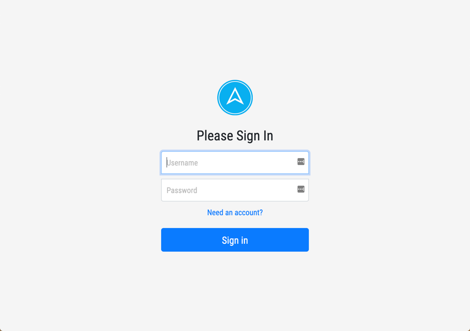
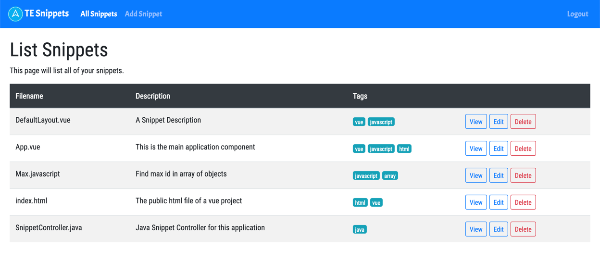

# TE Snippets

This is a demo application that will show off features of a VueJS application talking to a REST API written in Java or C#. 





## Getting Started 

Before you can dive in and take a look at the source code there are a couple of videos you need to check out. Please watch these and ask any questions you might have before moving on to setting up this project.

### Vue Router Introduction

Until now everything you have built in Vue has been Single File Components (SFC) but as you start to build out real world applications you will need to create different pages or views in your application. 

Frameworks like Vue/React/Angular have the ability to create Single Page Applications (SPA) where the application is loaded once and then when you hit a different route (/snippets/) the framework will find out what you want to do when that route is accessed. 

Vue Router is the official router for Vue.js. It deeply integrates with Vue.js core to make building Single Page Applications with Vue.js a breeze. Features include:

* Nested route/view mapping
* Modular, component-based router configuration
* Route params, query, wildcards
* View transition effects powered by Vue.js' transition system
* Fine-grained navigation control
* Links with automatic active CSS classes
* HTML5 history mode or hash mode, with auto-fallback in IE9
* Customizable Scroll Behavior

### Vue Router Walkthrough 

We created a quick video that walks you through how to add the router to a new project and how to use it. 

https://www.youtube.com/watch?v=Bq2MCYWDndc

After watching the video spend a little time [checking out the documentation](https://router.vuejs.org/) to learn what it can do for you.

### TE Snippets Overview

Now that you have an understanding of what the router does you can go through an overview of what this application does. Please send some time watching the following video that walks you through the UI & code for TE Snippets. 

https://www.youtube.com/watch?v=bmW_Ou5qaZ4

## TE Snippets Server-Side Setup

The first thing you will need to do is to get your server-side application up and running. 

### Java

To get started you will first need to create a new database called `te-snippets` in Postgres. I do this from the command line using the following command but feel free to create the database however you're used to doing so. 

```
CREATE DATABASE "te-snippets";
```

With the database created you can now run the scripts needed to create the schema and the data.

* backend/java/database/schema.sql
* backend/java/database/data.sql

The database connection is defined in `springmvc-servlet.xml`. If your connection string is different than the one defined below please make sure to update the url property.

```
<bean id="dataSource" class="org.apache.commons.dbcp2.BasicDataSource" destroy-method="close">
    <property name="driverClassName" value="org.postgresql.Driver" />
    <property name="url" value="jdbc:postgresql://localhost:5432/te-snippets" />
    <property name="username" value="postgres" />
    <property name="password" value="" />
</bean>
```

Now that your database is setup you should be able to run the application. You will to start your application and make sure there are no errors before moving on to the frontend application. 

### C#

To get started you will first need to create a new database called `te-snippets` in Sql Server. With your database in place you can run the schema initialization scripts located in 

* backend/dotnet/te-snippets-schema.sql

The connection string is defined in `appsettings.json` so if yours is different than the one below please update it now.

```
{
  "ConnectionStrings": {
    "Default": "Data Source=.\\SQLEXPRESS;Initial Catalog=te-snippets;Integrated Security=True"
  }
}
```

Now that your database is setup you should be able to run the application. You will to start your application and make sure there are no errors before moving on to the frontend application. 

## TE Snippets Front End Application

Now that you have the server-side application setup it's time to get the frontend application up and running. The first thing you will want to do is cd into the `frontend` directory and install any dependencies by running the following command. 

```
npm install
```

Next open up the file `frontend/.env`. This file contains both the C# and Java API URLS. You can remove whatever API you're not using and make sure the setting is not commented out. A `#` signifies a comment. 

```
# Java
VUE_APP_REMOTE_API=http://localhost:8080/TESnippets

# .NET
# VUE_APP_REMOTE_API=http://localhost:5000
```

With that you should be able to run your application using the command `npm run serve`. If you open up the application you should see the login screen. 


## TE Snippets Account

The /register route in both Java & .NET is not protected so anyone can create a new account. Create yourself an account and then go to the login page and use your new account to login. At this point you should see the home page and you won't have any snippets. 

